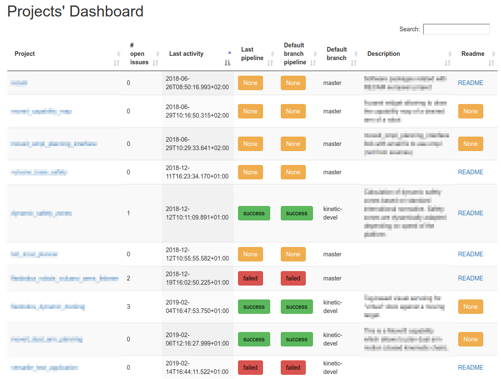

[](https://opensource.org/licenses/Apache-2.0)

# gitlab_utils

Some simple tools to interact with a GitLab server

## Overview

This repository contains a collection of scripts to interact with a GitLab server:

- `dashboard.py`: generate a simple html page with information about the projects inside a group (e.g. names, pipeline status, description).
- `bot-pipelines.py`: relaunch the pipelines that have not been launched for a specific number of days. I use this script in a cron job to be sure that applications/libraries do not break due to changes in the dependencies.
- `bot-statistics.py`: query some information about the projects in the group (e.g. number of projects, number of projects with succesfull pipelines) and append to a csv file. The aim is to produce nice plots afterwards. I also use this script in a cron job to accumulate data over time.

## Setup and installation

Python3 is required to run the scripts. They have been tested with Python `3.5` but will probably work in other versions.

A `requirements.txt` file is provided with the required Python modules. The recommended way of using it is using a _virtualenv_:

```bash
python3 -m venv venv
pip install -r requirements.txt
source venv/bin/activate
```

At this point you should be ready to run the scripts.

The scripts expect an access token to authenticate with the GitLab API. Check the GitLab documentation to learn how to generate the token.

## Usage

Currently the scripts require a GitLab access token, and an existing GitLab's group name.

All scripts have some minimal usage help, so be sure to check it using `python script_name.py --help`.

The initial idea that started this was to have an overview of the status of the projects, which you can probably have if you admin gives you access. If that is not the case, you can use the `dashboard.py` to generate something like this (sorry for blurring part of the text):



## Limitations

Too many to be listed here.

## Future work

Too much to be listed here.

Probably some error handling should be no. 1 priority.
